  

  

A Progressive Web App (PWA) designed to monitor my personal expenses by consolidating expenditures from various accounts and banks into one unified platform.

# MoneyTracker

🛠: [Next](https://nextjs.org/), [NextAuth](https://next-auth.js.org/), [Next-PWA](https://www.npmjs.com/package/next-pwa), [Tailwind](https://tailwindcss.com/), [Tremor](https://www.tremor.so/), [HeroIcons](https://heroicons.com/)

📚: [Vercel (Frankfurt)](https://vercel.com/)

🖥: https://github.com/walterdiazesa/moneytracker-api

# Description

Frontend for [MoneyTracker-API](https://github.com/walterdiazesa/moneytracker-api), I travel a lot, I have different bank accounts in different countries, different currencies, each of them have their own app to track the expenses of the card you have with them, with a poorly categorization system, so if I want to know **How much I had spend?**, **How much I had saved?**, and **How much am I able to spend before getting broke?** I would need to check all the different bank accounts, manually exchange currency rates for each of them and filter.

Other apps in the market solve this issue, the problem of them are:

- You can add your bank account(s), but almost all of them are only for 🇺🇸🦅 folks.
- If you're not from USA, you need to manually introduce all your expenses, even if they come from a credit/debit card.
- You need to manually exchange the currency to match values with your other expenses

I needed to centralize all my expenses from different sources, and they all shared one thing in common, they send mails as soon as you purchase something

```mermaid
flowchart TB
    bankA("🏦") --> Mail("📪")
    bankB("🏦") --> Mail("📪")
    bankC("🏦") --> Mail("📪")
    Mail("📪") --> MoneyTracker("📱")
```

So this app is basically

- **listening for those mails**
- **parse them**
- **exchange currency**
- **have the possibility to manually add cash expenses**
- **provide insights and charts about my expenses**

[MoneyTracker-Demo-Desktop-PWA.webm](https://github.com/walterdiazesa/moneytracker-api/assets/58494087/b225ace7-19bc-42e2-9ecd-fe213f41e6f1)

[MoneyTracker-Demo-IPhone-PWA.webm](https://github.com/walterdiazesa/moneytracker-api/assets/58494087/e328d2ce-474a-42ea-bcbf-fd5160d581c8)
